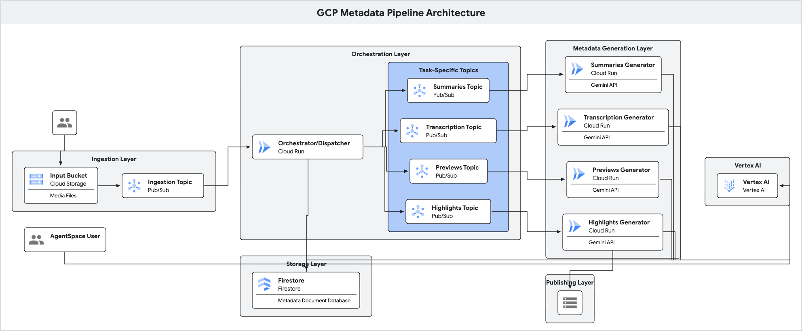

# Media Metadata Generator

This project is a scalable, event-driven pipeline built on Google Cloud to automatically generate rich metadata for media files. When a video, audio, or document file is uploaded to a Google Cloud Storage (GCS) bucket, this system triggers a series of serverless Cloud Run services to generate:

-   **Summaries & Chapters**: Using Vertex AI's Gemini models.
-   **Transcriptions**: Using the Google Cloud Speech-to-Text API.
-   **Video Previews/Shorts**: Using Vertex AI's Gemini models to identify key scenes.

All generated metadata is stored and managed in a central Firestore database.

## Architecture

The architecture is fully serverless and designed for scalability and decoupling of services.

1.  **File Upload**: A user or system uploads a media file to a designated GCS input bucket.
2.  **Initial Event**: An event notification (e.g., from a manual script or GCS trigger) is sent to a central Pub/Sub topic (`central-ingestion-topic`).
3.  **Dispatcher Service (`batch-processor-dispatcher`)**:
    -   A Cloud Run service subscribes to the central topic.
    -   It creates a new asset record in the Firestore `media_assets` collection.
    -   Based on the file type (video, audio, etc.), it dispatches tasks by publishing messages to specific Pub/Sub topics (`summaries-generation-topic`, `transcription-generation-topic`, etc.).
4.  **Metadata Generator Services**:
    -   Dedicated Cloud Run services (`summaries-generator`, `transcription-generator`, `previews-generator`) subscribe to their respective task topics.
    -   Each service processes the file and generates the required metadata.
    -   **`transcription-generator`**: Downloads the video, extracts audio with `ffmpeg`, uploads the audio back to GCS, and calls the Speech-to-Text API.
    -   **`summaries-generator` / `previews-generator`**: Pass the GCS URI of the media file directly to the Gemini API for analysis.
5.  **Firestore Update**: Each generator service updates the corresponding asset's document in Firestore with the results (`completed` status) or an error (`failed` status).

<p align="center">
  
</p>

---

## Prerequisites

1.  **Google Cloud Project**: A Google Cloud project with billing enabled.
2.  **gcloud CLI**: The Google Cloud CLI installed and authenticated.
3.  **Terraform**: Terraform installed (v1.0.0+).
4.  **Python**: Python 3.8+ installed.

---

## Deployment

### 1. Configure Terraform

First, copy the example variables file and customize it for your environment.

```bash
cp terraform/terraform.tfvars.example terraform/terraform.tfvars
```

Now, edit `terraform/terraform.tfvars` and set the following variables:

-   `project_id`: Your Google Cloud project ID.
-   `input_bucket_names`: A list of GCS bucket names that will trigger the pipeline.
-   `batch_processor_image`: The full Artifact Registry path for your dispatcher image.
-   `summaries_generator_image`: The full Artifact Registry path for your summaries image.
-   `transcription_generator_image`: The full Artifact Registry path for your transcription image.
-   `previews_generator_image`: The full Artifact Registry path for your previews image.

**Example `terraform.tfvars`:**
```hcl
project_id = "your-gcp-project-id"

input_bucket_names = [
  "your-gcp-project-id-input"
]

# Define your Docker image URLs explicitly here
batch_processor_image      = "us-central1-docker.pkg.dev/your-gcp-project-id/media-pipeline-images/batch_processor_dispatcher:latest"
summaries_generator_image  = "us-central1-docker.pkg.dev/your-gcp-project-id/media-pipeline-images/summaries_generator:latest"
transcription_generator_image = "us-central1-docker.pkg.dev/your-gcp-project-id/media-pipeline-images/transcription_generator:latest"
previews_generator_image   = "us-central1-docker.pkg.dev/your-gcp-project-id/media-pipeline-images/previews_generator:latest"
```

### 2. Build and Push Docker Images

This project is configured to use Google Cloud Build to build and push the service images directly to Artifact Registry. This removes the need for Docker to be installed on your local machine.

The build process is triggered by submitting the service's source code to Cloud Build. Repeat the following command for each service in the `/services` directory (`batch_processor_dispatcher`, `summaries_generator`, etc.).

```bash
# Example for the dispatcher service
export PROJECT_ID="your-gcp-project-id"
export REPO="media-pipeline-images"
export REGION="us-central1"
export IMAGE_NAME="batch_processor_dispatcher"

gcloud builds submit ./services/${IMAGE_NAME}/ \
  --project=${PROJECT_ID} \
  --tag="${REGION}-docker.pkg.dev/${PROJECT_ID}/${REPO}/${IMAGE_NAME}:latest"
```

### 3. Apply Terraform

Once your `.tfvars` file is configured and the Docker images have been pushed, you can deploy the infrastructure.

```bash
cd terraform

# Initialize Terraform
terraform init

# Plan the deployment
terraform plan

# Apply the changes
terraform apply
```

This will provision all the necessary resources: GCS buckets, Pub/Sub topics, Cloud Run services, Firestore database, and all required IAM permissions.

---

## How to Use

1.  **Upload a File**: Upload a video, audio, or document file to one of the GCS input buckets you defined in `input_bucket_names`.

    ```bash
    gsutil cp my-video.mp4 gs://your-gcp-project-id-input/
    ```

2.  **Trigger the Pipeline**: Publish a message to the `central-ingestion-topic` with the details of the uploaded file.

    **Message Payload:**
    ```json
    {
      "asset_id": "unique-asset-id-123",
      "file_name": "my-video.mp4",
      "file_location": "gs://your-gcp-project-id-input/my-video.mp4",
      "content_type": "video/mp4",
      "file_category": "video",
      "public_url": "https://optional-public-url/my-video.mp4"
    }
    ```

    **Publish with `gcloud`:**
    ```bash
    gcloud pubsub topics publish central-ingestion-topic --message='{"asset_id": "unique-asset-id-123", "file_name": "my-video.mp4", "file_location": "gs://your-gcp-project-id-input/my-video.mp4", "content_type": "video/mp4", "file_category": "video"}'
    ```

3.  **Monitor in Firestore**: You can now go to the Firestore console and view the `media_assets` collection. You will see a document with the ID `unique-asset-id-123`, and its `summary`, `transcription`, and `previews` fields will be updated in real-time as the services complete their tasks.

---